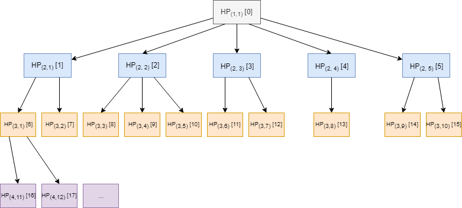
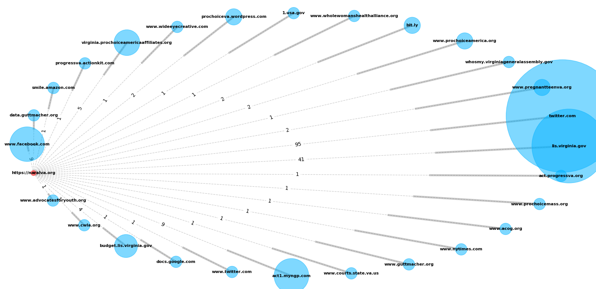

# HyperCrawler

In diesem Projekt geht es darum, von einer URL ausgehend so viele Fremdverlinkungen wie möglich zu finden. 
Fremdverlinkungen beziehen sich dabei auf Seiten, die kein Teil der übergebenen Domäne sind.

## Requirements
* Python 3.6.4
* s. [requirements.txt](requirements.txt)

# Konzept
Folgendes Bild verdäutlicht den Ablauf des Algorithmus: 
 
* HP: Homepage
* (m, n): m = Baumtiefe (depth), n = Position in der aktuellen Schicht
* [z]: Ablaufschritte im Algorithmus

Ausgehend von der Wurzel, werden alle Verlinkungen auf der Seite gesucht: \<a\>...\</a\>. Dabei werden Referenzen, die sich auf andere Seiten bzw. die eigene Domäne beziehen voneinander differenziert. Anschließend werden alle gefundenen Selbstreferenzen mittels Breitensuche nach neuen Verlinkungen abgesucht. 
Da Verlinkungen sehr tief reichen können, hat sich keine Tiefensuche angeboten. Weiterhin sollte die Suchtiefe nicht zu groß sein, da manche Seiten sehr viele Verlinkungen besitzen können.

## Ergebnisse
Als Ergebnis erhält man eine .log-Datei und eine .anl-Datei (analyze). Im Log werden alle gefundenen Links gespeichert. In der Analyse-Datei werden Domänen voneinander getrennt und die Menge an Referenzen aufsteigend sortiert. Im Folgenden sind Beispiele für https://naralva.org. 

### [naralva.log](results/logs/naralva.log) [naralva.anl](results/naralva.anl)

Seiten, auf denen Fremdverlinkungen gefunden wurden, werden auch gespeichert. Die Log-Datei dient während der Informationsextraktion eldiglich dazu, alle N Schritte die gefundenen Daten zu sichern, falls Fehler oder ein Systemabsturz geschehen. 

Ergbenisse in .anl-Dateien lassen sich auch als Graph visualisieren:
 
Umso größer die Knoten sind, desto mehr Verlinkungen existieren. 
<b>WICHTIG:</b> Verlinkungen werden in einem Set gespeichert. D.h. Duplikate werden nicht betrachtet. Falls es zu einer Seite H also N verlinkungen gibt, dann unterscheiden sich diese N Verlinkungen alle voneinander.