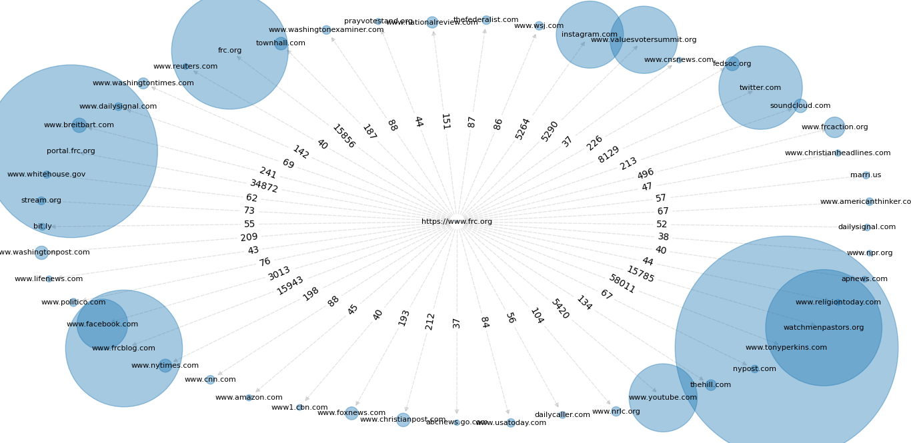

# Hyper Crawler

Hyper Crawler searches through a given domain and finds all hyper references (thus the name).
If a http(s)-reference links to the same domain, this one gets crawled too.
The concept is a **Breadth-first search**. Of course crawled sites won't get crawled again.
Once the crawler finishes, a .json-file gets created that contains:
* the root domain
* the searched depth
* all crawled sites
* all found foreign references

Afterwards you can visualise the result with an integrated tool.

**Use Cases**  
Imagine you want to find out what kind of sources a domain mainly uses. This way you could check
how reliable information for a specific domain is. 

## Tools and Requirements
* Python >= 3.6.4
* Python requirements: `pip install -r requirements.txt`
* setup your environment by copying the [.env.example file](hyper_crawler/.env.example), renaming it to .env 
in the same directory and setting the parameters.

## Usage
Crawl a specific domain (I suggest 2 for -d if you are unsure)
```shell script
python hyper.py crawl -r <domain> -d <max depth>
```

Plot the result
```shell script
python hyper.py plot -i <file name>
```

## Concept
Hyper Crawler interprets any URL as node of a graph. Each node can have many connections to different URLs by 
using references (edges). Since references to already visited sites are ignored, the graph can be interpreted as tree.
The following image contains a simple tree with root HP:


* HP: homepage
* (m, n): m = depth, n = position in layer
* \[z\]: time step visited --> breadth-first search, BFS

A root can be any domain `-r`. At first all hyper references \<a\>...\</a\> from `-r` are collected.
If any referenced site contains a reference to a `-r` domain, the algorithm will run again for this URL.
If the referenced site was already visited, it won't be checked again.
If the referenced site does not contain the `-r` domain, this site will not get crawled.

## Visualisation

The visualisation plots the top 50 most often occuring netlocs. The following example uses https://www.frc.org as root, depth = 3.


## Sites I checked with this tool

* https://www.acpeds.org
* https://www.frc.org
* https://www.nrlc.org
* https://eagleforum.org
* https://naralva.org
